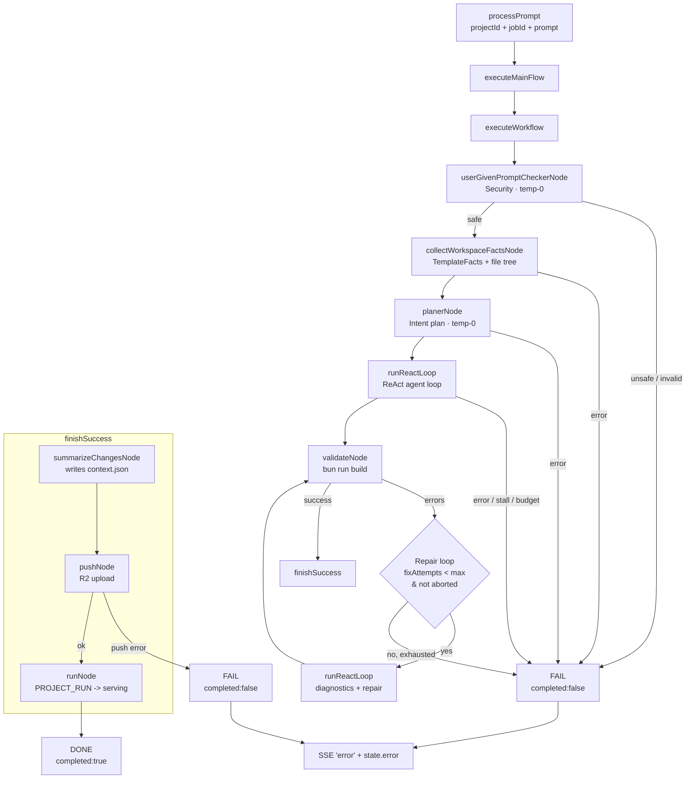

# Agent Architecture (apps/control)

The **control** app hosts the Lovable coding agent: it takes a natural-language
prompt, inspects a pulled React/Vite template on disk, edits it through a
sandboxed **ReAct tool loop**, validates the result with a real `bun run build`,
repairs failures up to a budget, and finally summarizes + persists + notifies the
platform. It is LLM-provider agnostic (Groq / Google / AI Router) and fully
hermetic in **eval mode** (no R2, no Redis, no external side effects).

> This document reflects the agent **after the Batch A / Batch B refactor**
> (branch `fix/agent-loop-hygiene`). Many historical stages (PromptAnalyzer,
> GetContext, EnhancePrompt, smart/error analyzers) were deleted — see
> [File reference](#file-reference).

---

## Flow

Entry is `processPrompt` (`src/agent/process/prompt.ts`), which resolves to
`executeMainFlow` → `executeWorkflow` (`src/agent/graphs/workflow.ts`). Every
phase runs inside an `observe()` trace span (Langfuse) and an
`AsyncLocalStorage` request runtime (`src/agent/runtime.ts`).

---

## Phases

| # | Phase | Node / file | Behavior | On failure |
|---|-------|-------------|----------|------------|
| 1 | **Security** | `userGivenPromptCheckerNode` — `tool/code/userGivenPromptChecker.ts` | temp-0 model scores the prompt against `SECURITY_PROMPT`; `isSafe:false` or unparsable JSON fails closed | throw → `error` |
| 2 | **Template facts** | `collectWorkspaceFactsNode` — `tool/templateFacts.ts` | Statically detects framework/build/language/styling/shadcn/package manager, entry points (`src/main.jsx`, `src/App.jsx`), dirs, and a glob file tree (≤400 files, ignore-filtered) | throw → `error` |
| 3 | **Intent plan** | `planerNode` — `tool/code/plannerPrompt.ts` | temp-0 `frozenModel` returns `{objective, areas, constraints, steps}` via `withStructuredOutput`; the agent treats it as guidance, **not** executable tool calls | throw → `error` |
| 4 | **ReAct loop** | `runReactLoop` — `graphs/toolLoop.ts` | Iteratively calls the model + 10 bound tools until no tool calls remain; guards below | returns `error` → thrown |
| 5 | **Build** | `validateNode` — `tool/code/validateBuild.ts` | Ensures essential files + `build` script, `bun install` if needed, then `bun run build`; parses stderr into categorized `BuildError[]` and sets `buildStatus: "success" \| "errors"` | → repair loop |
| 6 | **Repair** | inline in `workflow.ts` | Re-runs the ReAct loop with build diagnostics (≤ `MAX_REPAIR_STEPS` per iteration, ≤ `maxFixAttempts` total), then re-validates; `repair.error` is preserved so a failed repair stays failed | exhausted → error |
| 7 | **Finish** | `finishSuccess` — `workflow.ts:59` | **summarize → push → run** (see next) | push error → `completed:false` |

### finishSuccess ordering (Batch A)
1. `summarizeChangesNode` — inspects `toolResults` → structured `ChangeSummary`, LLM natural-language summary, writes `context.json` at the project root.
2. `pushNode` — walks the project (`getAllFiles`, ignore-filtered), uploads to R2. **Eval mode no-ops** so hermetic runs complete; a real push failure returns `{ ...state, completed: false }` — the flow stops rather than continuing to "run".
3. `runNode` — publishes `PROJECT_RUN` to serving (preview start). Deliberately does **not** rebuild (a second `PROJECT_BUILD_*` would steal the orchestrator waiter keyed on `projectId`).

On success, `processPrompt` stores a conversation memory using
`finalState.changeSummary.summary` (Bug #16; falls back to `buildStatus`).

---

## Tool registry

`tool/registry.ts` is the single source of truth. It declares each tool with a
`kind` (`read` | `mutate`) and derives `codingAgentTools`, `RETRIEVAL_TOOLS`, and
`MUTATION_TOOLS` (which also drive agent stats via `READ/MUTATION_TOOL_NAMES`).

### Read tools (3)

| Registered name | Source | Notes |
|---|---|---|
| `listFiles` | `simple/listDir.ts` | Lists files, ignore-filtered |
| `searchFiles` | `simple/grepSearch.ts` | Regex content search + glob filters |
| `readFile` | `simple/readFile.ts` | Output capped at **40k chars** (`truncated` flag); returns a content hash |

### Mutate tools (7)

| Registered name | Source | Notes |
|---|---|---|
| `createFile` | `simple/createFile.ts` | Fails if path exists |
| `updateFile` | `simple/updateFile.ts` | **Requires `expectedHash`** from a prior `readFile` (optimistic concurrency) |
| `patchFile` | `simple/replaceInFile.ts` | Exact-string replace; fails on 0 matches and on >1 without `replaceAll` |
| `deleteFile` | `simple/deleteFile.ts` | — |
| `addDependency` | `simple/addAndRemoveDependency.ts` | `bun add`; package names regex-validated (no shell metacharacters) |
| `removeDependency` | `simple/addAndRemoveDependency.ts` | `bun remove`; same validation |
| `addShadcnComponent` | `simple/addShadcnComponent.ts` | `bunx --bun shadcn@latest add …`; name regex-validated |

> `saveContext`/`validateBuild`/`buildSource`/`checkUserGivenPrompt` still exist as
> tool definitions but are **not bound to the agent loop** — they are used only by
> their orchestration nodes (`summarizeChangesNode`, `validateNode`, `runNode`,
> security check).

---

## Guards & invariants

- **Sandbox** (`tool/security.ts`)
  - `resolveSafePath` rejects `..`, absolute escapes, and symlink escapes (nearest-existing-ancestor probing).
  - `getProjectDir` prefers the request-scoped `AgentRuntime` dir over `process.env.PROJECT_ID`.
  - `runProcess` spawns **without a shell**, enforces a timeout, caps captured output, never rejects.
  - `sanitizeSubprocessEnv` hands subprocesses an **allow-listed** env (`PATH`, `HOME`, `NODE_ENV`, `TMPDIR`, `PORT`, `HOST`, `PWD`, `LANG`, `INIT_CWD`, `npm_config_*`, `VITE_*`) so cloud credentials can never reach them.
- **ReAct loop budgets** (`graphs/toolLoop.ts`): `MAX_AGENT_STEPS` (20), `MAX_TOOL_CALLS` (40), `MAX_AGENT_RUNTIME_MS` (8 min), stall detection (3 identical `name:args` calls).
- **Context management** (`toolLoop.ts` / `readFile.ts`): `MAX_READ_CHARS` 40k, `MAX_TOOL_MESSAGE_CHARS` 16k truncation, `CONTEXT_BYTE_BUDGET` 96k evicts the oldest large `ToolMessage` to `{omitted, tool}`.
- **Tool-call hygiene** (`toolLoop.ts`): missing `tool_call_id`s are synthesized as `missing_<tool>_<step>_<i>` and written back onto the response so provider tool messages link correctly.
- **Model selection** (`client.ts`): `model` = main coding loop at temp **0.3**; `frozenModel` = temp **0** for security + planner (deterministic classifiers). Provider resolution: `LLM_PROVIDER` → `AIROUTER_API_KEY` presence → Groq default.
- **Finish semantics**: a failed push yields `completed:false`; abort (`SIGINT`/eval timeout via `abortSignal`) yields `completed:false` everywhere.
- **SSE lifecycle** (`src/sse/index.ts`): `SSE_HOST` binding (default `127.0.0.1`), origin-restricted CORS + `OPTIONS`, clobber-safe reconnect (a new client for the same id ends the previous response), and `closeSSEServer()` on shutdown.

### SSE event map (client/orchestrator-visible)

| Phase | Event(s) |
|---|---|
| Entry | `started` |
| Workflow | `workflow_started` |
| Security | `checking_prompt`, `prompt_check_passed` / `prompt_check_failed`, `prompt_unsafe` |
| Facts | `collecting_facts`, `facts_ready` |
| Plan | `planning`, `planning_complete` / `planning_failed` |
| ReAct | `react_start`, `tool_executing`, `tool_completed`, `tool_error`, `react_complete` |
| Build | `validating`, `validation_success` / `validation_failed` |
| Repair | `repairing` |
| Finish | `build_success`, `summarizing`, `summary_complete` / `summary_error`, `pushing`, `pushed`, `running`, `app_running` |
| Terminal | `completed` (with final state) or `error` |

---

## File reference

### Orchestration (`src/agent/`)
| File | Role |
|---|---|
| `client.ts` | LLM singleton: `model` (0.3) + `frozenModel` (0), provider resolution, Langfuse wrapper |
| `runtime.ts` | Request-scoped `{projectId, projectDir, abortSignal}` via `AsyncLocalStorage` |
| `agentStats.ts` | Step/tool/build/read/mutate accumulator; read/mutate name sets derived from the registry |
| `index.ts` | Public barrel (workflow, runtime, prompt, client) |

### Graphs (`src/agent/graphs/`)
| File | Role |
|---|---|
| `main.ts` | `executeMainFlow`: create runtime → `runWithAgentRuntime(executeWorkflow)` |
| `workflow.ts` | State machine: phases, repair loop, `finishSuccess`, abort/error paths, `WorkflowState` |
| `toolLoop.ts` | ReAct loop: message building, tool execution, SSE, budgets, context eviction, stalls |

### Entry (`src/agent/process/`)
| File | Role |
|---|---|
| `prompt.ts` | `processPrompt`: SSE URL to orchestrator, memories, `executeMainFlow`, conversation-memory write with the change summary |

### Tool plumbing (`src/agent/tool/`)
| File | Role |
|---|---|
| `security.ts` | Path sandbox, subprocess env allow-list, timeout/capped `runProcess` |
| `result.ts` | `ToolResult`, `toolOk`/`toolFail`, `contentHash`, `countOccurrences` |
| `json.ts` | Parse LLM JSON (fences, trailing commas) |
| `registry.ts` | Tool registry + derived read/mutate sets (single source of truth) |
| `templateFacts.ts` | Static template inspection (`TemplateFacts`) + file tree |

### Simple tools (`src/agent/tool/simple/`)
`listDir.ts`, `grepSearch.ts`, `readFile.ts` (read); `createFile.ts`, `updateFile.ts`,
`replaceInFile.ts`, `deleteFile.ts`, `addAndRemoveDependency.ts`, `addShadcnComponent.ts`
(mutate); `ignorePatterns.ts` (`IGNORE_PATTERNS` + `shouldIgnoreFile`, shared);
`summarizeChanges.ts` (finish summary + `context.json`); `saveContext.ts`
(internal only, not agent-bound).

### Code-phase nodes (`src/agent/tool/code/`)
`userGivenPromptChecker.ts` (security gate), `plannerPrompt.ts` (intent plan),
`validateBuild.ts` (`bun run build` + error categorization), `buildSource.ts`
(`PROJECT_RUN` to serving), `stitchApp.ts` (template-App auto-composition helper;
kept but **no longer called from the workflow**).

### Platform handoff (`src/agent/tool/r2/`)
`push.ts` — `pushNode`: walk → filter → upload to R2; eval-mode no-op.

### Deleted in Batch B
`getContext.ts`, `writeMultipleFile.ts`, `lineReplace.ts`, `renameFile.ts`,
`testBuild.ts`, `checkMissingPackage.ts`, `promptAnalyzer.ts`, `smartAnalyzer.ts`,
`enhancePrompt.ts`, `intelligentErrorFixer.ts`, and `codingTools.ts` (absorbed
into `tool/registry.ts`).

### Tests
`tool/security.test.ts` (path sandbox + project-id validation),
`tool/simple/replaceInFile.test.ts` (patchFile semantics).